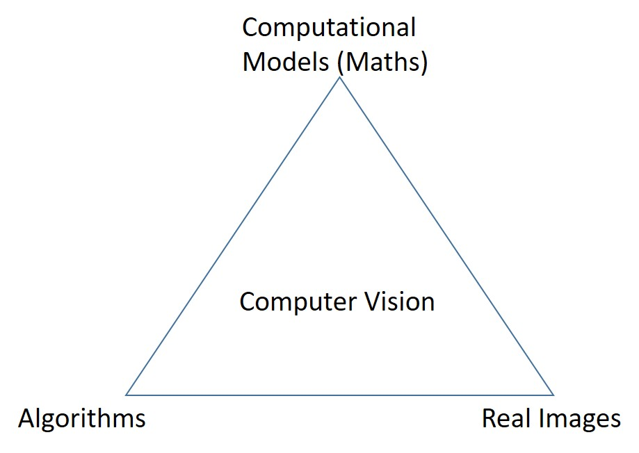

### Notes:
- Goal of computer Vision is to write computer programs that can interpret images.
- Object recognitionby mobile devices is also getting huge appalaude.
- Computer vision is also used in special effects like shape capture, motion capture. Also it is used in 3D modelling structure for motion. i.e. take many images and create 3D model.
- Computer vision is also used for smart cars.
- When showing sports, computer vision is used for augmented reality as well as showing particular location based advertisements.
- Kinect first started computer vision robustly into games. Kinect can generate depth images and more importantly skeleton intefaces
- Security and surveillance is most important field for computer vision.
- Similarly medical imaging from images	generated not by light source but by different sources like X-Ray, and magnetic. Also computer vison is used in image assisted surgery 

### Project/Code/Tutorials that can be done:
- OCR for license plate.
- Automated cheque clearance depositor
- Zip code hand written digit recognition
- Faces Detection in image
- Blink eye Detection in image
- smile Shutter
- Facial base login
- DMART app just like Lanehawk
- Detection and showing data about statue
- Quality grocery selection
- Dan Kersten's shadow lab tutorials
