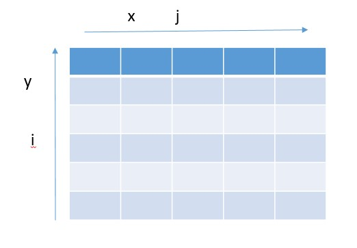

### Notes:
- Image is a function. So for gray scal Image    
 $I(x,y) = GrayscaleValue$
- So Image processing for computer vision is mostly image like values i.e. we take one image as input and output another image.
- An Image can be 2 Dimensional arrayof numbers with some minimum and maximum fixed value as range.
- A function $I = R^2 --> R$ where $(x , y)$ pixel image and $I(x , y)$ is intensity or value at position $(x, y )$
- In practice, we define ranges for $x$ and $y$ , so it would be   
       $f : [a : b] X [c : d] --> [min , max]   
	and intensity ranges from some min value to some max value.
- In case of color images, instead of one function we would have 3 functions, one for each color channel. So for color image, function would become:  
  $I = R^2 --> R^3$
- For a Digital Image, we need,  
	- Sample : Divide the 2 Dimensional space into regular grid i.e. divide 2 Dimensional area into a single point each.
	- Quantize : Quantify each sample i.e. convert the frequency at each point to closest integer.
- Quantization is required since we cannot use continuous real values.
- In image, pixel value is represented as $(x , y)$. It means x goes horizontally while y goes vertically      
- Since image is considered as matrix in computer, $i$ represents row and $j$ represents column 

- In summation of image, we need average of both pixel values. This can be done either by first taking half values of each pixel and then adding up or summing these values and then halving them. But in second case, numbers are stored in uint8  format. So if sum is greater than 255,  it will wrapped around starting from 0 again, which changes actual result.
- In scalar multiplication, if we multiply image with scalar greater than 1, it would give brighter image while scalar less than 1 will give darker image.
- Noise is just another function that is combined with original function to get a new function
		$I'(x,y) = I(x,y) + ŋ(x,y)
- Common types of noise
	1. Salt and Pepper : Random black and white pixels
	2. Impulse Noise : Random white pixels.
	3. Gaussian Noise (Normal Distributed noise) : Variation in intensity of pixels drawn from Gaussian Normal distribution
- Difference between 2 images
	- Difference Between 2 images can be calculated by simply subtracting them.
	- Brighter are in difference indicates where two images are differe more.
	- In difference, order matters. The images are stored in uint8 type. So for negative numbers, (pixel value of first image less than second image), roll over effect takes place and negative numbers are roll over to positive side and decreases(from 255 to 0)

### Project/Code/Tutorials that can be done:
- For any given grayscale image, print a surface with x and y as coordinates and gray scale value as value.
- Write a function to convert given matrix to quantized matrix with given min and max values.([notebook](2A_L1_Image_As_Function.ipynb))
- Load and Display Dolphin.png. Print its size and datatype.
