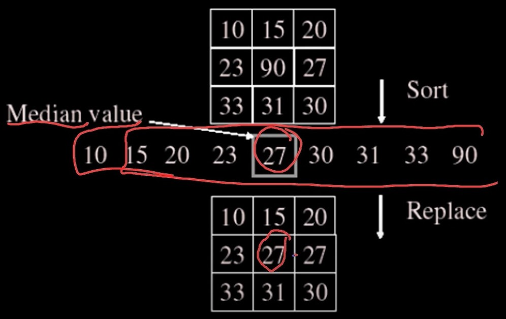

### Notes:
- Linear Operator
	- An operator H is linear if two properties hold : If f1 and f2 are function and a is constant then,
		- Additivity :     
		    $$H\left(f1+f2\right) = H\left(f1\right) + H\left(f2\right) $$
		- Multiplicativity scaling (Homogeneity of degree) :       
            $$H\left(a.f1\right) = a.H\left(f1\right) $$
	- Hence filtering is linear operation
- Impulse 
	- Linearity allows to build an image a piece at a time and then helps to understand how linear operator affects that image.
	- Building block of any such function mentioned above is impulse. So, in discrete world, impulse is just value 1 at a single location.
	- In continuouse world, impulse is an idealized function that has unit area 
	- For any unknown system, response for impulse by that system is impulse response. So if system is linear, impuslse response is h(x)
- Impulse response in Image:
	- Consider image with only 1 pixel value as 1 while all others are 0.
	- So when we run a correlational filter of impulse input, we get mask values vertically and horizonatally both flipped.
- How many multiples would happen for applying mask of size N \* N over and image of size M \* M :
	- So for each mask and one pixel of image, we have N \* N multiplications happening.
	- Filter will be performing operations for M \* M times
	- So total multiples are M \* M \* N \* N
- Convolution 
	- Now since correlational operation gives us output vertically and horizontally flipped, applying a already flipped filter will give output as it is.
	- Application of this flipped filter is called convolution.
	- So convolution filters image bottom to top and right to left.
	- For symmetric filters, correlational and convolutional operation makes no difference but the output of these 2 filters matters for asymmetric filters.
	- If we convolve an image with an impulse, we get original image.
- Shift Invariant
	- Operator behave same everywhere i.e. value of output depend upon pattern in image neighbourhood and not on position of neighbourhood.
- Filtering is Linear operation as correlation and Convolution are linear operation
- Properties of Convolution :
	- Linear and Shift Invariant
	- Commutative:
	 	$$f \* g = g \* f$$
	- Associative:
	 	$$\left(f \* g\right) \* h = f \* \left(g \* h\right)$$ 
	- Identity:
	 	$$unit\   impulse\    e = \left[...,0,0,1,0,0,...\right]\ then$$
	 		$$f \* e = f$$
	- Differentitation:
	 	$$\frac{\mathrm d}{\mathrm d x} \big( f \* g \big) = \left(\frac{\mathrm d}{\mathrm d x}f\right) \* g $$
-  Separability : 
  	- As above, For image of size W \* W and kernel (filter) of size N \* N, number of multiplications required are $$W^2N^2$$ which is huge.
  	- If kernel can be created by using one row and one column, it is called Linearly Separable Kernel.
  	- So filter is separable such that square kernel H can be obtain by convolving a single column vector with single row vector.
  		$${\left\lbrack \matrix{1 \cr 2 \cr 1} \right\rbrack} * \left\lbrack \matrix{1 & 2 & 1} \right\rbrack = \left\lbrack \matrix{1 & 2 & 1 \cr 2 & 4 & 2 \cr 1 & 2 & 1} \right\rbrack $$
- So we have $$C \* R = H$$ and we want $$G \= H \* F$$ So $$G = ( C \* R ) \* F$$ that is $$G = C \* (R \* F)$$ 
- So we have 2 convolution operation performed but each one is only performing $$W \* N \* N $$ multiplication.Thus total multiplications are $$2 \* W \* N^2$$ which are far less than $$W^2N^2$$
- Boundary Cases:
	- In case of boundaries, we can handle them in 3 ways:
		1. Full : 
			- Output is taken from position where filter is just touching the corner pixel. i.e corner pixel of image and corner pixel of filter are overlapping but filter is outside of image
			- Dimension of output image is larger than input image.
		2. Same :
			- Output is taken from position where corner pixel is at center of filter.
			- Dimension of output image is same as input image.
		3. Valid :
			- Output is taken from position where filter is completely inside image and it's outmost corner pixel is on corner pixel of image.
			- Dimension of output image is smaller than input image.    
			

- Now, above is mentioned how to use filter around the edges. If valid is considered then nothing more to do. But if Full or Same is considered, then pixels outside of images but within filter needs to have some values.
- So this can be done as follows:
 	- Clip Filter: 
 		- Consider the outer pixels all black.
 	- Wrap around : 
 		- Consider image is wrapped around i.e. image is rotating.
 		- Just like periodic signal where after a time interval, same signal is repeated, here image is repeated.
 	- Copy Edge (Replicate):
 		- Extend the edges till filter pixels in all direction.
 	- Reflection (Symmetric):
 		- Reflect pixels across edges. 
 		- So consider the edge as mirror and what we see at filter's pixels are nothing but pixel values going from edges to center pixels.
- Reflection is widely used as the created imagery has same statistics as that of original image.
- Different Filters:
	- Impulse:
		-	When, in an impulse filter,  the impulse is at center and when image convolve with such filter, we get original image as it is.
		- 	With impulse at different location than center, output image is gets shifted in opposite direction of impulse by 1. This is happened only when correlation is performed with filter. If Covolution is performed, output image is shifted in same direction as that of impulse.
	- If all 1's is filter and divided by sum of all 1's:
		- we get output image to be blurred. So this filter is crumy smoothy filter
	- 2*Impulse - just a above filter:
		- It acts as sharpening filter which sharpens the image.
- Why Unsharp mask makes sharper image:
	- In old days with negatives, an unsharped/burred negative of original image is used with original image negative to get sharper image. So this blurred negative becomes unsharp mask.
- Noise :
	- Gaussian Noise :
		- It is noise applied to each pixel independent of any other pixel.
		- This noise can be removed by applying Gaussian distribution/local averaging of pixels around the interested pixel, replacing pixel value by local average.
	- Salt and Pepper Noise :
		- The noise added by putting totally random values of pixels in image is called salt and pepper noise.
		- Here, instead of taking local average, where this random value will also contribute, we can search for median. And replace the pixel value by median value.
		- With this median value, we have avoided the contribution of higher pixel value or lower pixel value added completely at random. So we removed spikes in pixels.Good for salt and pepper noise as well as impulse noise.
		- Median Filter preserves edges. So it is non linear edge preserving filter.

		
